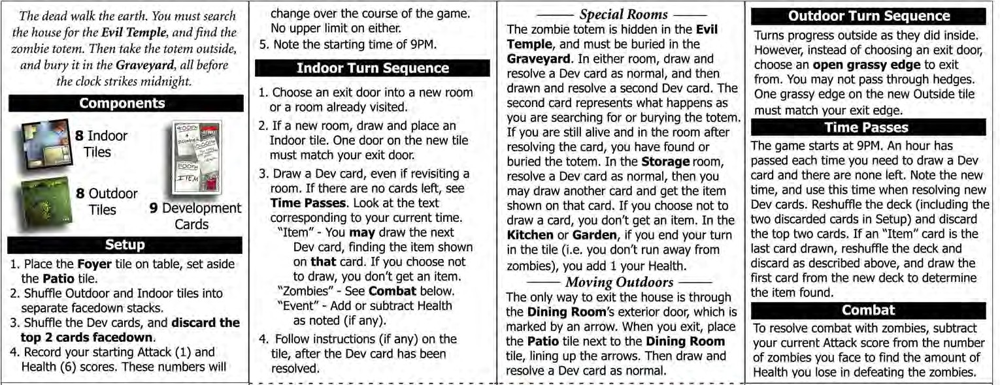
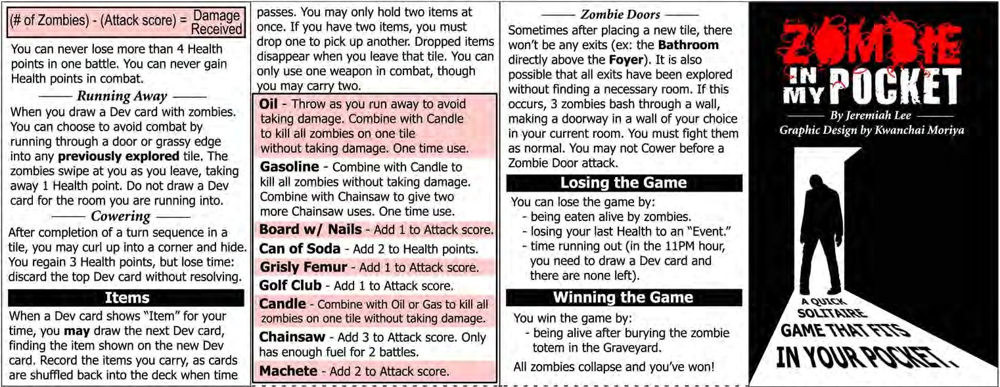

# ZIMPS

Project for my advanced programming course, BCDE321.

The project is based on recreating the board game [Zombies in My Pocket](http://funmines.com/wp-content/uploads/2014/12/zimp.pdf) using Python best practices.

## Team Members

Keagan Erasmus,
Christian Diekmann,
Sam Taylor-Claude

### Game Rules

